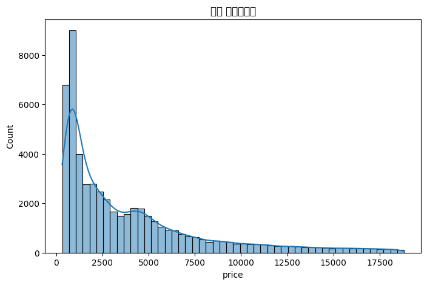
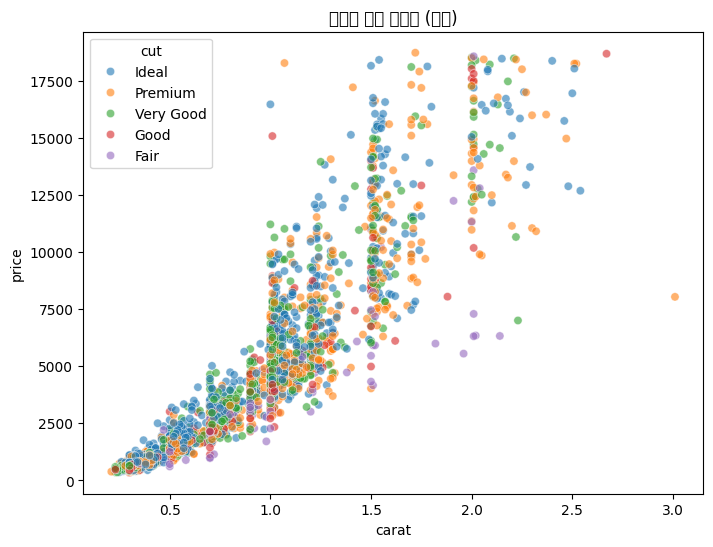
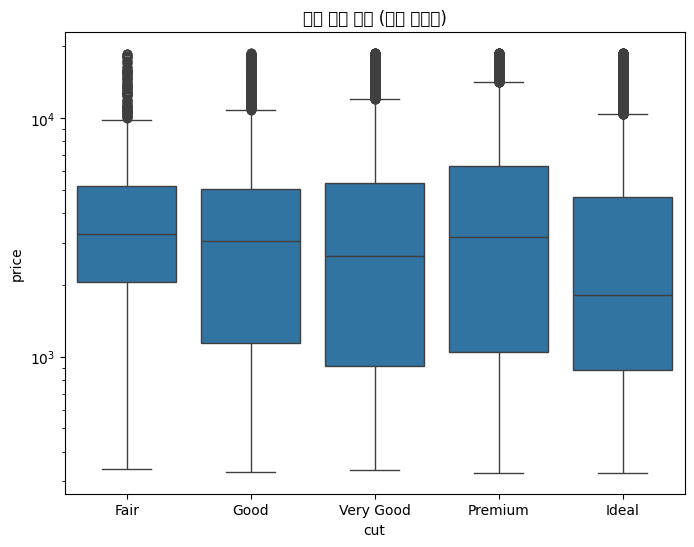
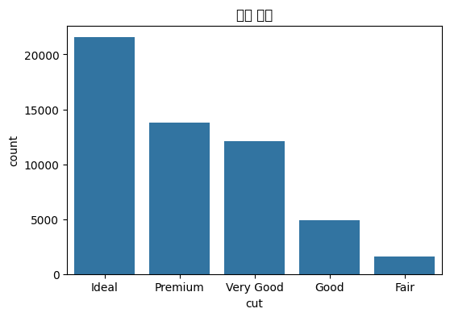
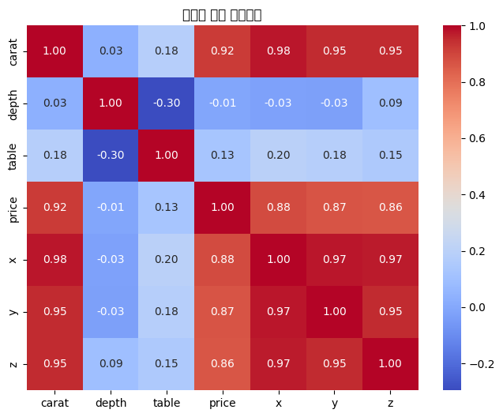
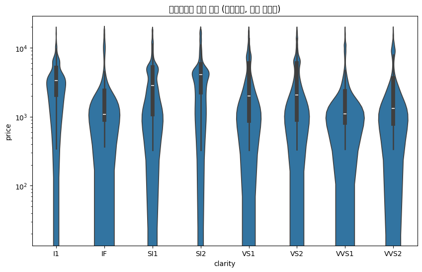

# Seaborn `diamonds` 데이터 EDA

## 1. 기본 정보 및 기초 기술통계

### 데이터 샘플

|    |   carat | cut     | color   | clarity   |   depth |   table |   price |    x |    y |    z |
|---:|--------:|:--------|:--------|:----------|--------:|--------:|--------:|-----:|-----:|-----:|
|  0 |    0.23 | Ideal   | E       | SI2       |    61.5 |      55 |     326 | 3.95 | 3.98 | 2.43 |
|  1 |    0.21 | Premium | E       | SI1       |    59.8 |      61 |     326 | 3.89 | 3.84 | 2.31 |
|  2 |    0.23 | Good    | E       | VS1       |    56.9 |      65 |     327 | 4.05 | 4.07 | 2.31 |
|  3 |    0.29 | Premium | I       | VS2       |    62.4 |      58 |     334 | 4.2  | 4.23 | 2.63 |
|  4 |    0.31 | Good    | J       | SI2       |    63.3 |      58 |     335 | 4.34 | 4.35 | 2.75 |

### 데이터 요약 (`info()` 및 기술통계)

```
<class 'pandas.core.frame.DataFrame'>
RangeIndex: 53940 entries, 0 to 53939
Data columns (total 10 columns):
 #   Column   Non-Null Count  Dtype   
---  ------   --------------  -----   
 0   carat    53940 non-null  float64 
 1   cut      53940 non-null  category
 2   color    53940 non-null  category
 3   clarity  53940 non-null  category
 4   depth    53940 non-null  float64 
 5   table    53940 non-null  float64 
 6   price    53940 non-null  int64   
 7   x        53940 non-null  float64 
 8   y        53940 non-null  float64 
 9   z        53940 non-null  float64 
dtypes: category(3), float64(6), int64(1)
memory usage: 3.0 MB

```

### 수치형 기술통계 (`describe`)

|       |        carat |       depth |       table |    price |           x |           y |            z |
|:------|-------------:|------------:|------------:|---------:|------------:|------------:|-------------:|
| count | 53940        | 53940       | 53940       | 53940    | 53940       | 53940       | 53940        |
| mean  |     0.79794  |    61.7494  |    57.4572  |  3932.8  |     5.73116 |     5.73453 |     3.53873  |
| std   |     0.474011 |     1.43262 |     2.23449 |  3989.44 |     1.12176 |     1.14213 |     0.705699 |
| min   |     0.2      |    43       |    43       |   326    |     0       |     0       |     0        |
| 25%   |     0.4      |    61       |    56       |   950    |     4.71    |     4.72    |     2.91     |
| 50%   |     0.7      |    61.8     |    57       |  2401    |     5.7     |     5.71    |     3.53     |
| 75%   |     1.04     |    62.5     |    59       |  5324.25 |     6.54    |     6.54    |     4.04     |
| max   |     5.01     |    79       |    95       | 18823    |    10.74    |    58.9     |    31.8      |

### 범주형 통계 (value counts)

#### `cut` 분포

| cut       |   count |
|:----------|--------:|
| Ideal     |   21551 |
| Premium   |   13791 |
| Very Good |   12082 |
| Good      |    4906 |
| Fair      |    1610 |

#### `color` 분포

| color   |   count |
|:--------|--------:|
| G       |   11292 |
| E       |    9797 |
| F       |    9542 |
| H       |    8304 |
| D       |    6775 |
| I       |    5422 |
| J       |    2808 |

#### `clarity` 분포

| clarity   |   count |
|:----------|--------:|
| SI1       |   13065 |
| VS2       |   12258 |
| SI2       |    9194 |
| VS1       |    8171 |
| VVS2      |    5066 |
| VVS1      |    3655 |
| IF        |    1790 |
| I1        |     741 |

## 2. Price 분포 (히스토그램)



#### Cut별 Price 요약 (count / mean / median / std)

| cut       |   count_price |   mean_price |   median_price |   std_price |
|:----------|--------------:|-------------:|---------------:|------------:|
| Ideal     |         21551 |      3457.54 |         1810   |     3808.4  |
| Premium   |         13791 |      4584.26 |         3185   |     4349.2  |
| Very Good |         12082 |      3981.76 |         2648   |     3935.86 |
| Good      |          4906 |      3928.86 |         3050.5 |     3681.59 |
| Fair      |          1610 |      4358.76 |         3282   |     3560.39 |

## 3. Carat vs Price 산점도



#### Carat 구간별 & Cut별 평균 Price

| carat_bin      |    Ideal |   Premium |   Very Good |     Good |     Fair |
|:---------------|---------:|----------:|------------:|---------:|---------:|
| (0.195, 1.002] |  1598.59 |   1810.72 |     1919.03 |  2113.64 |  2445.06 |
| (1.002, 1.803] |  7969.81 |   7362.75 |     7393.83 |  6659.91 |  5589.17 |
| (1.803, 2.605] | 15437.4  |  14810.8  |    15013    | 14411    | 11503.5  |
| (2.605, 3.407] | 15795.7  |  14039.3  |    12951    | 16219.8  | 12430    |
| (3.407, 4.208] | 12587    |  16335    |    15984    |   nan    | 14498.5  |
| (4.208, 5.01]  |   nan    |    nan    |      nan    |   nan    | 18274.5  |

## 4. Cut별 Price 분포 (Boxplot)



#### Cut별 Price 기술통계 (describe)

| cut       |   count |    mean |     std |   min |     25% |    50% |     75% |   max |
|:----------|--------:|--------:|--------:|------:|--------:|-------:|--------:|------:|
| Ideal     |   21551 | 3457.54 | 3808.4  |   326 |  878    | 1810   | 4678.5  | 18806 |
| Premium   |   13791 | 4584.26 | 4349.2  |   326 | 1046    | 3185   | 6296    | 18823 |
| Very Good |   12082 | 3981.76 | 3935.86 |   336 |  912    | 2648   | 5372.75 | 18818 |
| Good      |    4906 | 3928.86 | 3681.59 |   327 | 1145    | 3050.5 | 5028    | 18788 |
| Fair      |    1610 | 4358.76 | 3560.39 |   337 | 2050.25 | 3282   | 5205.5  | 18574 |

## 5. Cut 분포 (Countplot)



#### Cut vs Color 교차표 (count)

| cut       |    D |    E |    F |    G |    H |    I |   J |
|:----------|-----:|-----:|-----:|-----:|-----:|-----:|----:|
| Ideal     | 2834 | 3903 | 3826 | 4884 | 3115 | 2093 | 896 |
| Premium   | 1603 | 2337 | 2331 | 2924 | 2360 | 1428 | 808 |
| Very Good | 1513 | 2400 | 2164 | 2299 | 1824 | 1204 | 678 |
| Good      |  662 |  933 |  909 |  871 |  702 |  522 | 307 |
| Fair      |  163 |  224 |  312 |  314 |  303 |  175 | 119 |

## 6. 수치형 변수 상관관계 (Heatmap)



#### 상관행렬 (수치 표)

|       |     carat |      depth |     table |      price |          x |          y |         z |
|:------|----------:|-----------:|----------:|-----------:|-----------:|-----------:|----------:|
| carat | 1         |  0.0282243 |  0.181618 |  0.921591  |  0.975094  |  0.951722  | 0.953387  |
| depth | 0.0282243 |  1         | -0.295779 | -0.0106474 | -0.0252892 | -0.0293407 | 0.0949239 |
| table | 0.181618  | -0.295779  |  1        |  0.127134  |  0.195344  |  0.18376   | 0.150929  |
| price | 0.921591  | -0.0106474 |  0.127134 |  1         |  0.884435  |  0.865421  | 0.861249  |
| x     | 0.975094  | -0.0252892 |  0.195344 |  0.884435  |  1         |  0.974701  | 0.970772  |
| y     | 0.951722  | -0.0293407 |  0.18376  |  0.865421  |  0.974701  |  1         | 0.952006  |
| z     | 0.953387  |  0.0949239 |  0.150929 |  0.861249  |  0.970772  |  0.952006  | 1         |

## 7. Clarity별 Price 분포 (Violin)



#### Clarity별 Price 요약

| clarity   |   count_price |   mean_price |   median_price |   std_price |
|:----------|--------------:|-------------:|---------------:|------------:|
| IF        |          1790 |      2864.84 |           1080 |     3920.25 |
| VVS1      |          3655 |      2523.11 |           1093 |     3334.84 |
| VVS2      |          5066 |      3283.74 |           1311 |     3821.65 |
| VS1       |          8171 |      3839.46 |           2005 |     4011.75 |
| VS2       |         12258 |      3924.99 |           2054 |     4042.3  |
| SI1       |         13065 |      3996    |           2822 |     3799.48 |
| SI2       |          9194 |      5063.03 |           4072 |     4260.46 |
| I1        |           741 |      3924.17 |           3344 |     2806.78 |

---
### 결론 요약

- `price`는 오른쪽으로 치우친 분포를 보이며, `carat`과 `price`는 강한 양의 상관관계를 가짐.
- `cut`, `clarity`, `color`는 평균 가격에 차이를 보이며, `clarity` 및 `cut`이 가격에 큰 영향을 줌.
